# Dine AR Application

  

## About the App
This is an iOS application that was created as part of Augmented Reality Course in Bachelors at Trinity College Dublin.

With the help of this app, a user can view food items on a restaurant menu in 3D. I find it hard to order food without properly knowing the amount, and I am sometimes hesitant to order new dishes unless I see it on the table myself. So, I think this app can help a customer make informed orders at a restaurant.

The app first detects a horizontal plane and makes the user aware by showing feature points in yellow and a pink grid. Then the user can click anywhere on the grid to render the model. If she/he is not satisfied with the position of the model, the user can click on the trash icon to remove the model. Now, the user has a fresh plane.

## Screenshots

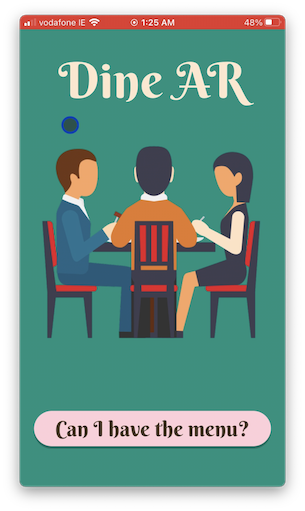
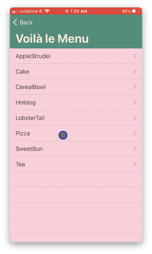
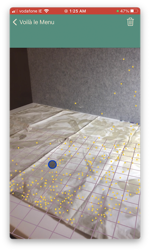
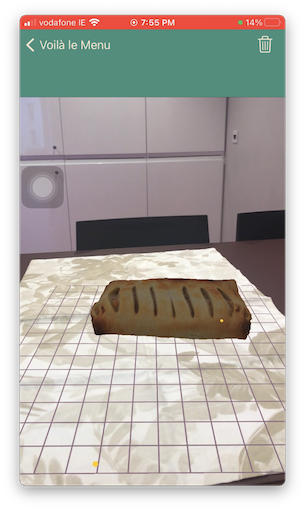
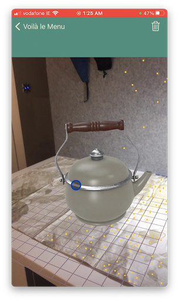
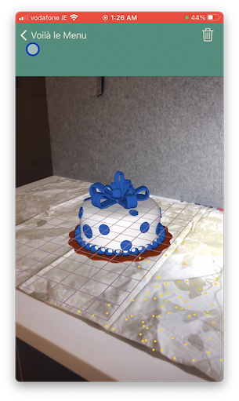
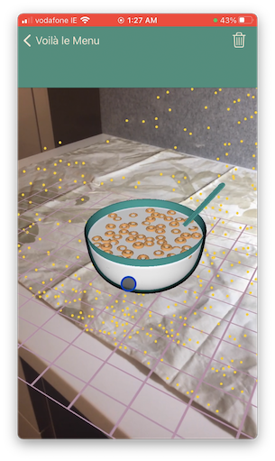
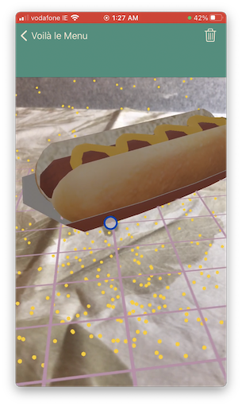
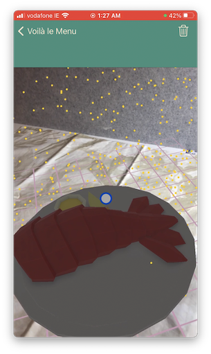
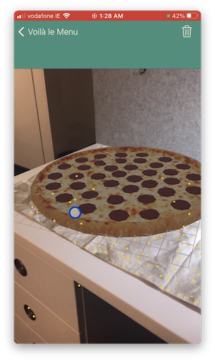
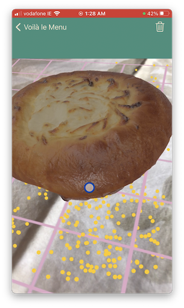

## Video Demo

[Click Here](https://youtu.be/tW3-lpaThEo)
